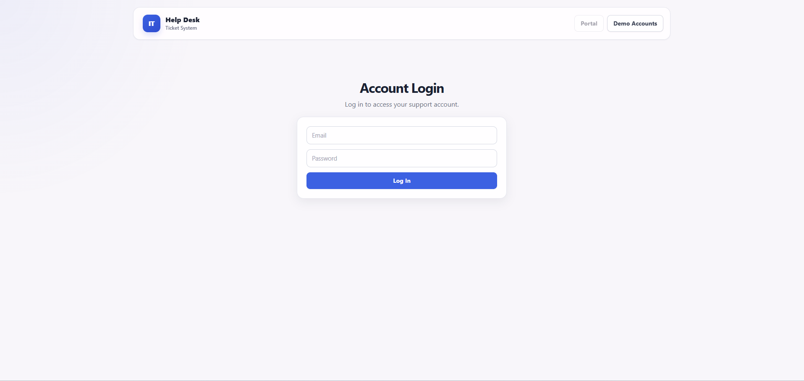
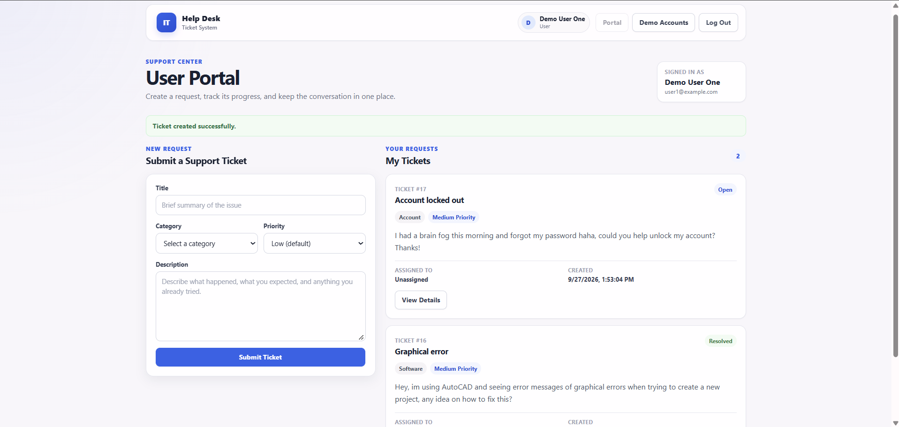
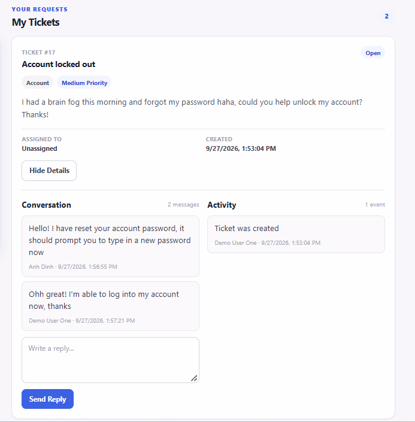
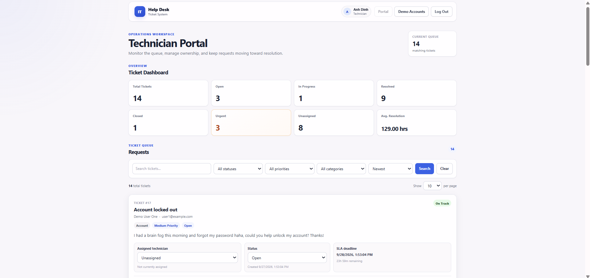
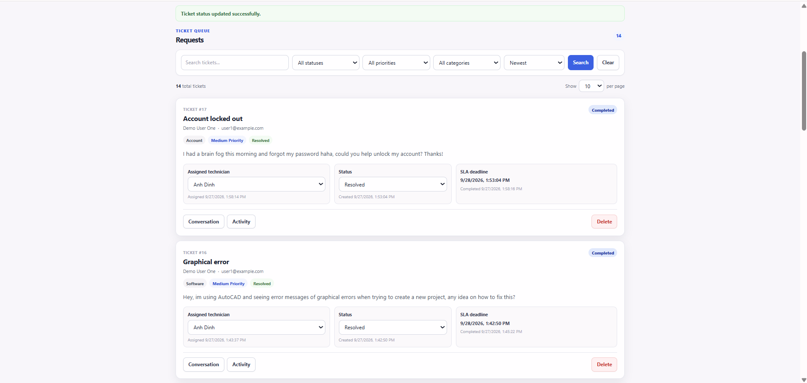
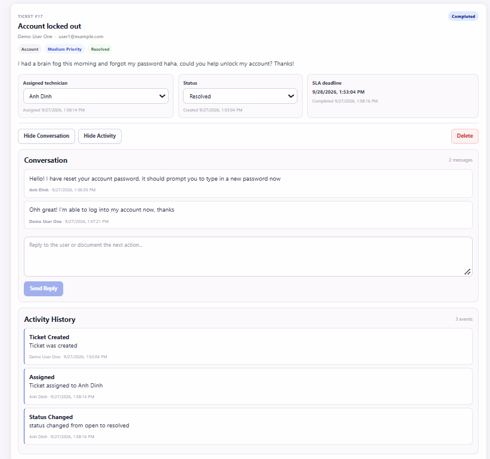
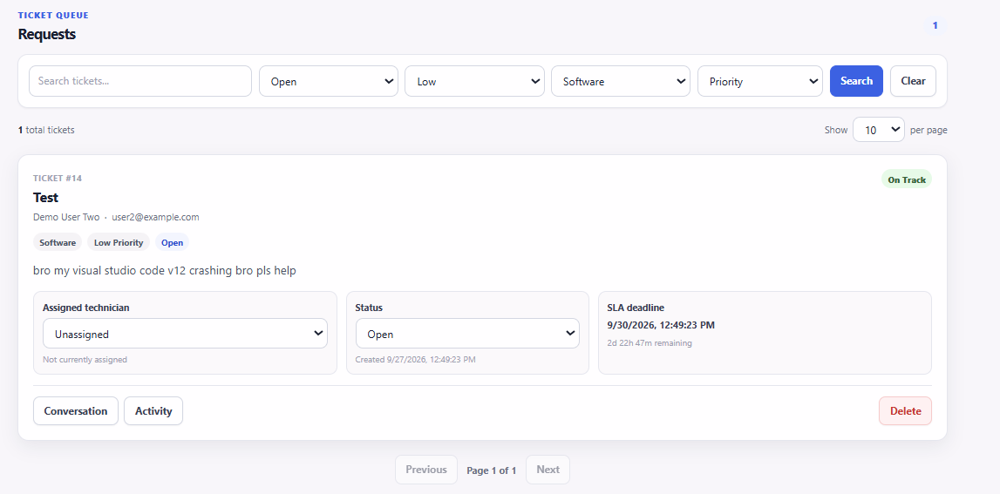

# IT Help Desk Ticket System

A full-stack IT help desk ticket management application built with React, Node.js, Express, and PostgreSQL.

The application supports authenticated users and technicians with role-based access. Users can submit and track their own support tickets, communicate with technicians, and review ticket activity. Technicians can manage the full ticket queue, assign tickets, update statuses, add comments, review activity history, and monitor dashboard analytics.

---

## Live Demo

- **Frontend:** https://it-helpdesk-ticket-system-1.onrender.com
- **Backend API:** https://it-helpdesk-backend-jocp.onrender.com
- **API Health Check:** https://it-helpdesk-backend-jocp.onrender.com/api/health

> The backend is hosted on Render's free tier, so the first request after a period of inactivity may take a short time while the service starts.

---

## Demo Accounts

The deployed application includes dedicated demo accounts for testing the different roles.

### Technician

```text
Email: anh@example.com
Password: DemoHelpdeskTech!2026
```

### User 1

```text
Email: user1@example.com
Password: DemoHelpdeskUser1!2026
```

### User 2

```text
Email: user2@example.com
Password: DemoHelpdeskUser2!2026
```

The two user accounts can be used to verify ticket ownership and access control. Each regular user can only access tickets belonging to their own account, while technicians can access the complete ticket queue.

---

## Screenshots

### Login


### User Portal




### Technician Dashboard





### Ticket Management




## Features

### Authentication and Authorization

- Register new user accounts
- Log in using email and password
- Password hashing with bcrypt
- JWT-based authentication
- Persistent login sessions
- Role-based access for users, technicians, and administrators
- Protected backend routes
- User ownership validation for ticket access
- Logout support

### User Portal

Authenticated users can:

- Submit IT support tickets
- Select a ticket category and priority
- View only tickets belonging to their account
- Track ticket status
- View assigned technician
- View ticket creation details
- Expand tickets to view additional information
- View ticket activity history
- View technician responses
- Reply to technicians through the ticket conversation
- Receive success and error feedback during requests

User identity is determined from the authenticated account rather than trusting a name or email supplied by the client.

### Technician Portal

Technicians can:

- View the complete ticket queue
- Search ticket titles and descriptions
- Filter by status
- Filter by priority
- Filter by category
- Filter by assigned technician
- Sort by newest, oldest, priority, or status
- Paginate through ticket results
- Select the number of tickets shown per page
- Assign and reassign tickets to technicians
- Unassign tickets
- Update ticket status
- Add ticket comments
- View conversations with users
- View ticket activity history
- Delete tickets
- View SLA information
- View dashboard analytics

### Ticket Activity Tracking

The application records ticket events such as:

- Ticket creation
- Status changes
- Technician assignment
- Technician reassignment
- Ticket unassignment

Activity records include a description, timestamp, and the user or technician responsible for the action.

### SLA Tracking

Tickets receive an SLA deadline based on priority:

| Priority | SLA |
|---|---:|
| Urgent | 4 hours |
| High | 8 hours |
| Medium | 24 hours |
| Low | 72 hours |

The technician portal displays SLA status and remaining time.

### Dashboard Analytics

The technician dashboard includes:

- Total tickets
- Open tickets
- In-progress tickets
- Resolved tickets
- Closed tickets
- Urgent tickets
- Unassigned tickets
- Average resolution time

---

## Technologies Used

### Frontend

- React
- Vite
- JavaScript
- HTML
- CSS
- Fetch API

### Backend

- Node.js
- Express
- PostgreSQL
- node-postgres (`pg`)
- bcrypt
- JSON Web Tokens (`jsonwebtoken`)
- REST API
- CORS
- dotenv

### Database

- PostgreSQL
- Neon

### Deployment

- Render Static Site for the React frontend
- Render Web Service for the Express backend
- Neon for the hosted PostgreSQL database

---

## Architecture

```text
┌─────────────────────┐
│     React / Vite    │
│      Frontend       │
└──────────┬──────────┘
           │
           │ HTTPS / REST
           │ JWT Authorization
           ▼
┌─────────────────────┐
│   Node.js / Express │
│       Backend       │
└──────────┬──────────┘
           │
           │ Parameterized SQL
           ▼
┌─────────────────────┐
│     PostgreSQL      │
│        Neon         │
└─────────────────────┘
```

The frontend authenticates users through the Express API and stores the returned JWT in local storage. Protected API requests send the token using the `Authorization: Bearer <token>` header.

The backend validates the token, loads the authenticated user from PostgreSQL, and applies role and ownership checks before allowing access to protected resources.

---

## Project Structure

```text
IT-Helpdesk-Ticket-System/
├── backend/
│   ├── db.js
│   ├── server.js
│   ├── seedDemoUsers.js
│   ├── package.json
│   └── package-lock.json
│
├── frontend/
│   ├── public/
│   ├── src/
│   │   ├── assets/
│   │   ├── pages/
│   │   │   ├── LoginPage.jsx
│   │   │   ├── TechnicianPage.jsx
│   │   │   └── UserPage.jsx
│   │   ├── App.css
│   │   ├── App.jsx
│   │   ├── config.js
│   │   ├── index.css
│   │   └── main.jsx
│   ├── package.json
│   └── vite.config.js
│
├── database.sql
├── .gitignore
└── README.md
```

---

## API Overview

### Authentication

```http
POST /api/auth/register
POST /api/auth/login
GET  /api/auth/me
```

### User Tickets

```http
GET  /api/my-tickets
POST /api/tickets
GET  /api/tickets/:id
```

### Ticket Conversation

```http
GET  /api/tickets/:id/comments
POST /api/tickets/:id/comments
```

Regular users can access comments only for tickets they own. Technicians and administrators can access comments for any ticket.

### Ticket Activity

```http
GET /api/tickets/:id/activity
```

Regular users can access activity for their own tickets. Technicians and administrators can access activity for any ticket.

### Technician Ticket Management

```http
GET    /api/tickets
PUT    /api/tickets/:id
DELETE /api/tickets/:id
```

These routes require technician or administrator access.

### Technician List

```http
GET /api/users/technicians
```

### Analytics

```http
GET /api/tickets/analytics
```

### Health Check

```http
GET /api/health
```

Example response:

```json
{
  "message": "API and database are connected"
}
```

---

## Ticket Filtering

The technician ticket endpoint supports query parameters such as:

| Parameter | Description |
|---|---|
| `search` | Search ticket titles and descriptions |
| `status` | Filter by ticket status |
| `priority` | Filter by ticket priority |
| `category` | Filter by category |
| `assignedTo` | Filter by technician ID or unassigned tickets |
| `sort` | Sort by newest, oldest, priority, or status |
| `page` | Current page |
| `limit` | Number of tickets per page |

Example:

```http
GET /api/tickets?status=open&priority=high&sort=newest&page=1&limit=10
```

---

## Database Design

The application uses several related PostgreSQL tables.

### Users

Stores application accounts and roles.

Important fields include:

```text
id
name
email
password_hash
role
created_at
```

### Tickets

Stores support tickets.

Important fields include:

```text
id
user_id
name
email
title
category
description
priority
status
created_at
updated_at
assigned_at
resolved_at
sla_due_at
assigned_to_user_id
```

Relationships:

```text
tickets.user_id
    → users.id

tickets.assigned_to_user_id
    → users.id
```

The `user_id` identifies the account that owns the ticket.

The `assigned_to_user_id` identifies the technician currently assigned to the ticket.

### Ticket Comments

Stores the ticket conversation between users and technicians.

### Ticket Activity

Stores ticket history and audit events such as assignments and status changes.

---

## Allowed Ticket Values

### Categories

```text
Hardware
Software
Network
Account
Other
```

### Priorities

```text
low
medium
high
urgent
```

### Statuses

```text
open
in progress
resolved
closed
```

---

## Security

The project includes several backend security practices:

- Passwords are hashed using bcrypt
- Authentication uses signed JSON Web Tokens
- Protected routes require a valid JWT
- Role-based middleware protects technician functionality
- Ticket ownership is checked server-side
- Regular users cannot access another user's tickets
- Regular users cannot access another user's comments or activity history
- Technician identities are determined from authenticated accounts
- Ticket ownership is determined from authenticated user IDs
- PostgreSQL queries use parameterized placeholders
- Allowed ticket values are validated by the backend
- Production CORS is restricted to the deployed frontend
- Database credentials and JWT secrets are stored in environment variables
- `.env` files are excluded from GitHub

---

## Running the Project Locally

### Prerequisites

Install:

- Node.js
- npm
- PostgreSQL or access to a PostgreSQL database
- Git

### 1. Clone the repository

```bash
git clone https://github.com/dinhanh0/IT-Helpdesk-Ticket-System.git
cd IT-Helpdesk-Ticket-System
```

### 2. Configure backend environment variables

Create:

```text
backend/.env
```

Example:

```env
DATABASE_URL=your_postgresql_connection_string
JWT_SECRET=your_jwt_secret
FRONTEND_URL=http://localhost:5173
```

Do not commit the `.env` file.

### 3. Install and run the backend

```bash
cd backend
npm install
npm run dev
```

Backend:

```text
http://localhost:5000
```

Health check:

```text
http://localhost:5000/api/health
```

### 4. Install and run the frontend

Open another terminal:

```bash
cd frontend
npm install
npm run dev
```

Frontend:

```text
http://localhost:5173
```

---

## Frontend Environment Configuration

The frontend uses:

```js
export const API_URL =
  import.meta.env.VITE_API_URL ||
  "http://localhost:5000";
```

For production:

```env
VITE_API_URL=https://it-helpdesk-backend-jocp.onrender.com
```

---

## Backend Production Environment Variables

The Render backend uses environment variables such as:

```env
DATABASE_URL=your_neon_postgresql_connection_string
JWT_SECRET=your_jwt_secret
FRONTEND_URL=https://it-helpdesk-ticket-system-1.onrender.com
```

Render provides the production `PORT` automatically.

Sensitive values should only be stored in environment variables.

---

## Demo User Seeding

The backend contains a demo account seed script.

From the backend directory:

```bash
npm run seed-demo-users
```

The script creates or updates the dedicated demo accounts used by the deployed application.

---

## What I Learned

Through this project, I gained experience with:

- Designing a full-stack application using React, Express, and PostgreSQL
- Implementing JWT authentication
- Hashing and validating passwords with bcrypt
- Designing role-based authorization
- Implementing server-side resource ownership checks
- Designing relational database relationships with foreign keys
- Migrating ticket assignment from names to user IDs
- Implementing CRUD API endpoints
- Designing ticket assignment and reassignment workflows
- Building user-to-technician ticket conversations
- Creating ticket activity and audit history
- Implementing SLA calculations
- Building dashboard analytics with PostgreSQL aggregate queries
- Implementing searching, filtering, sorting, and pagination
- Managing asynchronous loading, success, and error states in React
- Connecting a React frontend to an Express REST API
- Using environment variables across local and production environments
- Configuring CORS between separately deployed services
- Deploying a React frontend, Express backend, and PostgreSQL database
- Debugging production network requests and environment configuration

---

## Future Improvements

Potential future improvements include:

- File attachments
- Email notifications
- Password reset functionality
- Automated frontend and backend tests
- API rate limiting
- Improved accessibility
- Additional mobile responsive styling
- Notification indicators for new ticket replies
- Separate internal technician notes from user-visible conversation messages
- Additional reporting and analytics charts

---

## Author

**Anh Dinh**

Computer Science graduate interested in software engineering, full-stack development, cloud technologies, and IT systems.
